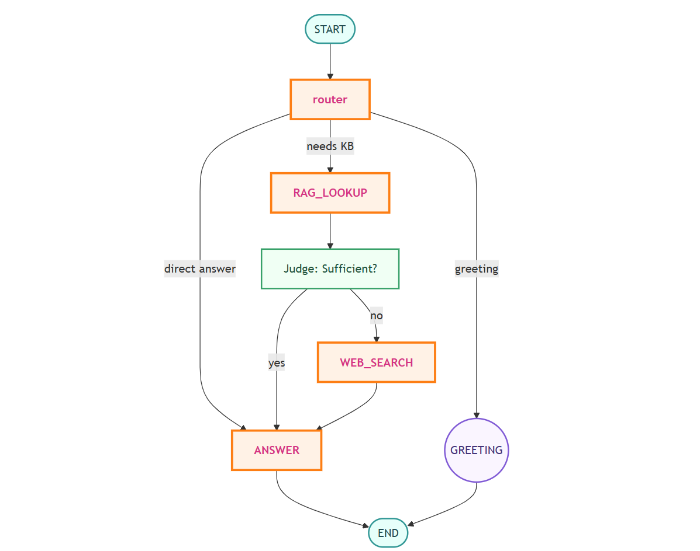

# RAG AGENT Chatbot

Welcome to the RAG AGENT Chatbot, a powerful and intelligent assistant that leverages Retrieval-Augmented Generation (RAG) to provide accurate and context-aware responses. This chatbot can understand and process information from uploaded PDF documents, a pre-loaded knowledge base, and real-time web searches.

## 🚀 Demo

[Link to the live demo](https://your-demo-link.com)

## ✨ Features

- **📄 PDF Upload**: Upload a PDF document to provide instant context for your questions.
- **🗄️ Vector-Store RAG**: A pre-loaded knowledge base (`starxai.pdf`) containing information about Starx AI technology.
- **🌐 Web Search**: Falls back to a web search if the information is not available in the provided context or knowledge base.
- **🤖 Conversational AI**: A user-friendly chat interface for seamless interaction.
- **🏠 Home Page**: A welcoming home page that provides an overview of the chatbot's capabilities and architecture.

##  Agent Architecture

The RAG AGENT Chatbot is built using a sophisticated agent architecture that intelligently routes user requests to the most appropriate tool. The agent's workflow is as follows:



1. **User Input**: The user asks a question or uploads a PDF document.
2. **Routing**: The agent analyzes the user's input and decides which tool to use:
   - **PDF Context**: If a PDF is uploaded, the agent prioritizes the content of the document.
   - **Vector-Store RAG**: If the question is related to the pre-loaded knowledge base, the agent queries the vector store.
   - **Web Search**: If the information is not found in the provided context or knowledge base, the agent performs a web search.
3. **Response Generation**: The agent generates a response based on the information retrieved from the selected tool.
4. **Display**: The response is displayed to the user in the chat interface.

## 🛠️ Technologies Used

- **Streamlit**: For the user interface and chat application.
- **LangChain**: For building the RAG agent and managing the language model.
- **Langsmith**: For monitoring and debugging the agent.
- **ChromaDB**: For creating and managing the vector store.
- **Tavily**: For the web search functionality.
- **OpenAI**: For the language model (gpt-4.1-mini).

## 🚀 Getting Started

### Prerequisites

- Python 3.11+
- An OpenAI API key

### Installation

1. **Clone the repository**:
   ```bash
   git clone https://github.com/nefro_313/RAG_agent_chatbot.git
   cd RAG_agent_chatbot
   ```

2. **Install the dependencies**:
   ```bash
   pip install -r requirements.txt
   ```

3. **Set up your environment variables**:
   Create a `.env` file in the root directory and add your OpenAI API key:
   ```
   OPENAI_API_KEY="your-api-key"
   TAVLIY_API_KEY="your_tavliy_key"
   LANGSMITH_API_KEY="your_langsmith_key"
   ```
5. **Run the application**:
   ```bash
   streamlit run app.py
   ```

## 🧪 How to Test

1. **Test the RAG functionality**:
   - Download the `starxai.pdf`  . To Know the Rag Source.
   - Ask questions like:
     - "What is the aim of the Starx AI technology?"
     - "Who is the CEO of Starx AI technology?"

2. **Test the web search functionality**:
   - Ask questions like:
     - "Who is the current President of the USA?"
     - "What is the feedback of the F1 movie released starring Brad Pitt?"

3. **Test the PDF upload functionality**:
   - Upload the `testfile.pdf` from the streamlit sidebar.
   - Ask questions like:
     - "Why is Sanna Vaara saying she is worried?"
     - "Who is Sanna Vaara?"
